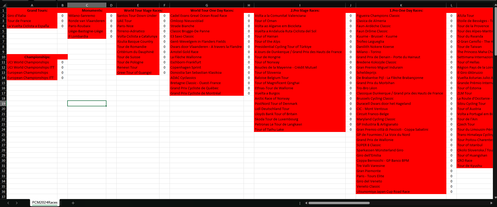

# 🏁 PCM2024 WorldDB2025 Race Tracker Excel Generator

Generates an Excel file with all cycling races from **PCM2024 WorldDB2025**, grouped by category and sorted by date, including conditional formatting to visually track victories per race.

## 📌 What is this?

This tool creates a **blank track record** for all races included in the WorldDB2025 database for **Pro Cycling Manager 2024**. It’s designed to be used alongside your **Career or Pro Cyclist Mode** save, acting as a personal tracker of which races you’ve won.

With conditional formatting, races with **0 victories are shown in red**, and when you update a cell to **1 or more victories**, the race name highlights **green** — so you can instantly see your progress.

## 🎯 Use Case

This is could be useful if you're trying to:
- Win all **World Tour** races in your save
- Keep a personal log of your achievements across your career
- Simulate a rider’s palmarès or chase after specific goals (e.g. win all Monuments or Grand Tours)

## 📁 What You Get

- An Excel file (`.xlsx`) with:
  - All races from the PCM2024 WorldDB2025
  - Grouped by category (e.g., Grand Tours, Monuments, National Championships)
  - Sorted by race date within each category
  - Conditional formatting that turns race names green when you input a victory (any number > 0)

## 🛠️ How to Use

1. Clone or download this repository
2. Build and run the project
3. An Excel file will be generated at your chosen location
4. Open it in Excel or compatible spreadsheet software
5. Start filling in your victories (`0`, `1`, `2`, etc.)
6. Watch your honors list light up in green as you progress!

## ⚙️ Options

You can choose to include or exclude **National Championships** and **Under-23 races** depending on your preference. By default, both are included in the export.

## 📷 Preview

Enjoy tracking your career like a pro! 🚴‍♂️💚